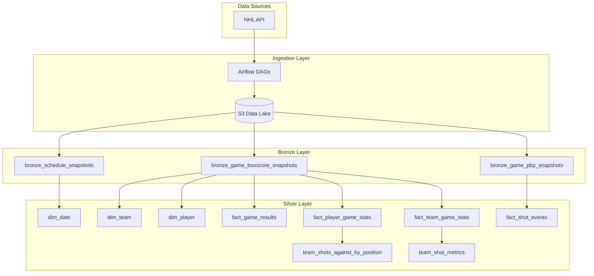

# NHL Data Analytics Pipeline

A production-grade data platform for NHL game analytics, featuring automated ingestion, medallion architecture transformation, and dimensional modeling for advanced statistics and player performance analysis.

## Project Overview
This project is a comprehensive data engineering pipeline designed to ingest, process, and analyze NHL game data. 

**Primary Goal:**  
The short-term objective is to generate predictive reports for NHL players, specifically focusing on **Shots on Goal (SOG)** projections. This will serve as a foundation for analyzing player props and performance trends.

**Future Roadmap:**
- Expand analysis to other statistical categories (Goals, Assists, Time on Ice, etc.).
- Implement a full CI/CD lifecycle with distinct Development and Production environments.
- Integrate advanced visualization dashboards.
- Implement ML/AI tooling for further analysis.
- Playing with streaming datasets during live games.
- **A/B Testing for Defensive Models:** Warehouse-native experimentation using Eppo to compare position-based vs location-based shots-against models for predicting goals allowed.

## Architecture Overview
```
NHL API → Airflow (MWAA) → S3 (Data Lake) → Snowflake (Raw) → dbt (Bronze/Silver/Gold) → Analytics
```

## Data Lineage

📊 **[View Interactive Lineage Graph](https://nhl-data-pipeline.github.io/nhl-data-pipeline/)** (GitHub)



## Technology Stack
This project serves as a practical playground for mastering modern data engineering technologies:

*   **Languages:** Python, SQL
*   **Development Environment:** VS Code with WSL (Ubuntu)
*   **Orchestration:** Apache Airflow
*   **Cloud Infrastructure:** AWS (S3, IAM)
*   **Data Warehousing:** Snowflake
*   **Transformation:** dbt (Data Build Tool)
*   **Processing:** PySpark (planned)
*   **Visualization:** Looker / Tableau (planned)

## Architecture & Infrastructure

### Cloud Setup (AWS)
The project leverages AWS for scalable storage and security:
*   **MWAA (Managed Workflows for Apache Airflow):** Used for hosting the Airflow environment in the cloud.
*   **S3:** Acts as the Data Lake, storing raw JSON responses from the NHL API (Schedule, Boxscores, Play-by-Play, Skater Reports).
*   **IAM:** Granular Identity and Access Management roles are being implemented to secure services, though some components currently use broader permissions during the development phase.

### Environment Strategy
*   **Current State:** The project is currently operating in a **Development** environment.
*   **Future State:** A formal promotion strategy (Dev &rarr; Stage &rarr; Prod) is planned to ensure reliability and data quality.

## CI/CD & Quality Assurance
To maintain code quality and ensure reliable deployments, the project utilizes a structured CI/CD pipeline with multiple GitHub Actions workflows:

### GitHub Actions Workflows

| Workflow | Trigger | Purpose |
|----------|---------|---------|
| **CI** | Push/PR to `main`, `develop` | Linting (`ruff`) and unit tests (`pytest`) |
| **Deploy to MWAA** | Push to `main` | Syncs DAGs, plugins, and dbt project to S3 for MWAA |
| **dbt Docs** | Push to `main` (dbt changes) | Generates and deploys dbt documentation to GitHub Pages |
| **Data Quality Validation** | After MWAA deploy + every 4 hours | Runs Snowflake Time Travel validation checks |

### Development Process
*   **Branching Strategy:** Feature branches → `develop` → `main` (production)
*   **Pull Request Process:** All changes require a PR with passing CI checks
*   **AI-Assisted Development:** Leveraging AI coding assistants (GitHub Copilot, Claude) as pair programming tools to accelerate development while maintaining code quality through testing and reviews

### Automated Deployments
*   **MWAA Sync:** DAGs, plugins, and requirements automatically deploy to AWS MWAA on merge to `main`
*   **dbt Project:** Transformed models sync to S3 for scheduled dbt runs
*   **Documentation:** dbt docs auto-publish to GitHub Pages for interactive lineage exploration

## Data Quality & Observability
Robust data quality practices ensure reliable analytics:

*   **Automated Testing:** dbt tests validate critical data constraints (uniqueness, not_null, accepted_values)
*   **Metadata Extraction:** Game IDs and partition dates extracted from S3 file paths during ingestion
*   **Time Travel Validation:** Snowflake Time Travel monitors for unexpected data changes
*   **Issue Resolution:** Identified and fixed regex extraction bug causing 100% NULL metadata in production data (see commit history)

## Current Progress

### 1. Data Ingestion Layer
Built a robust Python-based ingestion module (`src/nhl_pipeline/ingestion`) that interacts with public NHL APIs.
*   **Schedule Fetcher:** Retrieves daily game schedules.
*   **Game Data:** Fetches detailed Boxscores and Play-by-Play (PBP) data.
*   **Skater Reports:** Captures granular stats for individual skaters.
*   **S3 Integration:** All raw data is automatically uploaded to an S3 Data Lake.

### 2. Orchestration (Airflow)
Airflow DAGs have been deployed to automate the workflow:
*   `nhl_daily_ingestion_dag`: Runs daily to fetch the latest game data.
*   `nhl_backfill_dag`: Handles historical data loading to populate the warehouse.
*   `nhl_raw_stats_skater_daily`: Specialized pipeline for daily skater statistics.

### 3. Data Warehouse (Snowflake + dbt)
Implements a medallion architecture (Bronze → Silver → Gold) for data quality and analytics:

*   **Bronze Layer:** Immutable raw data views with automated data quality tests
    - `bronze_schedule_snapshots`: Daily game schedules
    - `bronze_game_boxscore_snapshots`: Game-level boxscore data
    - `bronze_game_pbp_snapshots`: Play-by-play event data
    - 10 dbt tests validating critical fields (all passing)
*   **Silver Layer:** Dimensional model with fact and dimension tables (in progress)
    - `dim_date`: Date dimension with NHL season-aware logic
    - `dim_team`, `dim_player`: Implemented sparse team and player dimensions
    - `fact_game_results`, `fact_player_game_stats`: Implemented fact tables
*   **Gold Layer:** Pre-aggregated analytics and ML-ready features (planned)

## Getting Started

### Prerequisites
*   Python 3.x
*   AWS CLI configured

### Setup
Use the provided Makefile to set up the environment. This runs `setup_wsl.sh` to configure system dependencies and `setup_venv.sh` to initialize the Python virtual environment:
```bash
make setup
```

### Testing
Run the test suite to ensure ingestion logic is working correctly:
```bash
make test
```

### Data Quality Validation
Monitor data quality using Snowflake Time Travel to detect unexpected changes:
```bash
make validate-data
```
This compares current table states with historical snapshots (default: 1 hour ago) and alerts on significant changes in row counts or null values. See [Time Travel Validation Documentation](docs/time_travel_validation.md) for details.

## About This Project

Hey folks, my name is Cullen. I've spent the last 10 years as a software engineer focused on the Microsoft toolchain. In an effort to learn industry-standard data engineering tools, I'm building this project that combines my passions: the NHL and data!

Some choices may seem excessive for a personal project, but I'm intentionally modeling how enterprise organizations use these tools in production environments. This includes:
- Proper CI/CD workflows with PR reviews and automated testing
- Structured data architecture (medallion + dimensional modeling)
- Infrastructure as code and environment separation
- Comprehensive documentation and data quality monitoring

## Key Technical Learnings

*   **Data Quality Investigation:** Debugged production issues using SQL queries to identify root causes (regex extraction bug)
*   **Dimensional Modeling:** Applied grain definition, slowly changing dimensions, and denormalized design patterns for cloud warehouses
*   **Idempotency Patterns:** Designed transformation logic for reliable reprocessing and incremental loads
*   **Modern Data Stack:** Hands-on experience with industry-standard tools (Airflow, dbt, Snowflake, AWS)
*   **Cloud Cost Optimization:** Balancing normalization vs denormalization for query performance and storage costs